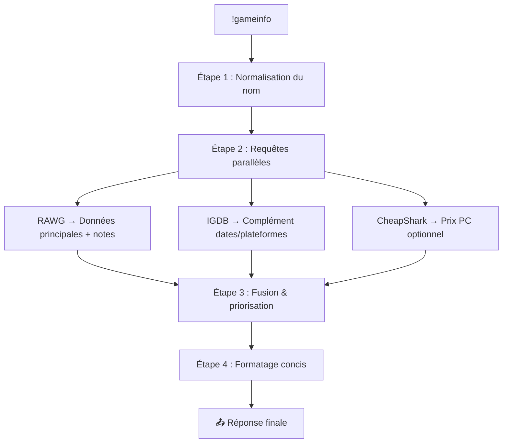

 # 🎮 TODO: Refonte commande !gameinfo (RAWG prioritaire)

**Date:** 2025-10-20  
**Objectif:** Refaire la commande `!gameinfo` avec RAWG comme API principale, IGDB en fallback/complément

## 📊 État actuel

### Fichiers concernés
- ✅ `/src/core/commands/game_command.py` - Handler de la commande
- ✅ `/src/core/igdb_api.py` - API IGDB (actuellement utilisée)
- ⚠️ `/src/core/rawg_api.py` - API RAWG (existe mais pas utilisée dans gameinfo)
- ✅ `/src/utils/game_utils.py` - Utilitaires (fetch_game_data, etc.)

### Problèmes identifiés
1. **RAWG sous-exploité** - L'API existe mais n'est pas utilisée dans la commande
2. **IGDB seul** - Actuellement on utilise uniquement IGDB avec fallback web scraping
3. **Pas de fusion** - On ne combine pas les données de plusieurs sources
4. **Manque d'infos** - Pas de notes/ratings, pas de prix, pas de durée de jeu

---

## 🎯 Vision globale du pipeline !gameinfo (v3)



---

## 📋 Todo List détaillée

### Phase 1: Améliorer l'intégration RAWG (Priorité 1)

#### ✅ État: RAWG API existe déjà
Fichier: `/src/core/rawg_api.py`
```python
def query_rawg_game(game_name, config):
    # Retourne: name, summary, release_date, platforms
```

#### 🔧 Tâches Phase 1

**1.1 Enrichir `rawg_api.py`** ⏳
- [ ] Ajouter récupération des **ratings** (Metacritic, notes utilisateurs)
- [ ] Ajouter **screenshots** (optionnel, pour futur enrichissement)
- [ ] Ajouter **genres** et **tags**
- [ ] Ajouter **stores** (Steam, Epic, etc.) pour liens d'achat
- [ ] Gérer les erreurs proprement (retry, timeouts)
- [ ] Ajouter fonction async: `async def query_rawg_game_async(game_name: str, config: dict) -> dict`

**Format de sortie enrichi:**
```python
{
    'name': str,
    'summary': str,  # description_raw
    'release_date': str,  # ISO format
    'platforms': list[str],
    'metacritic': int | None,  # Note Metacritic
    'rating': float | None,  # Note utilisateurs RAWG
    'ratings_count': int,
    'genres': list[str],
    'stores': list[dict],  # [{'store': 'Steam', 'url': '...'}]
    'screenshots': list[str],  # URLs optionnelles
}
```

**1.2 Modifier `fetch_game_data()` dans `game_utils.py`** ⏳
- [ ] Appeler RAWG **en priorité**
- [ ] Utiliser IGDB en **fallback** si RAWG échoue
- [ ] Ou mieux: **fusionner les deux** sources (voir Phase 2)

**Exemple de logique:**
```python
async def fetch_game_data(game_name: str, config: dict) -> dict:
    # 1. Essayer RAWG en premier
    rawg_data = await query_rawg_game_async(game_name, config)
    if rawg_data:
        print(f"[GAME] ✅ RAWG trouvé: {rawg_data['name']}")
        return rawg_data
    
    # 2. Fallback IGDB
    igdb_data = await fetch_igdb_data(game_name)
    if igdb_data:
        print(f"[GAME] ✅ IGDB fallback: {igdb_data['name']}")
        return igdb_data
    
    # 3. Fallback web scraping IGDB
    return await search_igdb_web(game_name)
```

---

### Phase 2: Fusion RAWG + IGDB (Priorité 2)

**Objectif:** Combiner le meilleur des deux APIs

#### 🎯 Stratégie de fusion

| Donnée | Source prioritaire | Raison |
|--------|-------------------|---------|
| **Nom** | RAWG | Plus à jour |
| **Description** | RAWG `description_raw` | Mieux maintenue |
| **Date de sortie** | RAWG | Plus fiable pour jeux récents |
| **Plateformes** | IGDB | Plus complète (catégories détaillées) |
| **Notes/Ratings** | RAWG | Metacritic + notes utilisateurs |
| **Résumé court** | IGDB `summary` | Plus concis |
| **Genres** | Fusionner les deux | Complémentaires |

#### 🔧 Tâches Phase 2

**2.1 Créer fonction de fusion** ⏳
```python
async def merge_game_data(rawg_data: dict, igdb_data: dict) -> dict:
    """
    Fusionne les données de RAWG et IGDB intelligemment.
    """
    return {
        'name': rawg_data.get('name') or igdb_data.get('name'),
        'summary': rawg_data.get('summary') or igdb_data.get('summary'),
        'release_date': rawg_data.get('release_date') or igdb_data.get('first_release_date'),
        'platforms': igdb_data.get('platforms') or rawg_data.get('platforms'),
        'metacritic': rawg_data.get('metacritic'),
        'rating': rawg_data.get('rating'),
        'genres': list(set(
            rawg_data.get('genres', []) + igdb_data.get('genres', [])
        )),
        # ... autres champs
    }
```

**2.2 Modifier `fetch_game_data()` pour fusionner** ⏳
- [ ] Lancer RAWG et IGDB **en parallèle** avec `asyncio.gather()`
- [ ] Fusionner les résultats avec `merge_game_data()`
- [ ] Gérer les cas où une seule API répond

---

### Phase 3: Améliorer l'affichage de `!gameinfo` (Priorité 2)

#### 🔧 Tâches Phase 3

**3.1 Ajouter les notes dans le message** ⏳
```python
# Exemple d'affichage:
@user 🎮 The Witcher 3 (2015), PC, PS4, Xbox
⭐ Metacritic: 92/100 | Note RAWG: 4.6/5 (450k avis)
Description...
(lien) (cooldown)
```

**3.2 Ajouter émojis pour les plateformes** ⏳
```python
platform_emojis = {
    'PC': '💻',
    'PS5': '🎮',
    'PS4': '🎮',
    'Xbox': '🎮',
    'Switch': '🕹️',
}
```

**3.3 Améliorer la gestion de la longueur** ⏳
- [ ] Prioriser: nom, date, notes, description courte
- [ ] Tronquer la description si trop longue
- [ ] Garder la limite de 500 caractères

---

### Phase 4: Intégrations optionnelles (Priorité 3)

#### 💰 4.1 CheapShark - Prix PC

**API:** https://apidocs.cheapshark.com/  
**Gratuite:** Oui (pas de clé requise)

**Tâches:**
- [ ] Créer `/src/core/cheapshark_api.py`
- [ ] Fonction `async def get_game_price(game_name: str) -> dict | None`
- [ ] Intégrer dans `!gameinfo` si plateforme = PC
- [ ] Format: `💰 Prix: 29,99€ (Steam) — Actuellement en promo!`

**Exemple d'intégration:**
```python
if 'PC' in platforms:
    price_data = await get_game_price(game_name)
    if price_data:
        message += f"\n💰 {price_data['price']} ({price_data['store']})"
```

#### ⏱️ 4.2 HowLongToBeat - Durée de jeu

**API:** Non officielle, bibliothèque Python disponible  
**Package:** `howlongtobeatpy`

**Tâches:**
- [ ] Installer: `pip install howlongtobeatpy`
- [ ] Créer `/src/core/hltb_api.py`
- [ ] Fonction `async def get_playtime(game_name: str) -> str | None`
- [ ] Format: `⏱️ 40h (histoire) | 120h (100%)`

#### 🎮 4.3 Commandes bonus

**Nouvelles commandes à créer:**
- [ ] `!prix <jeu>` - Prix rapide (CheapShark)
- [ ] `!note <jeu>` - Notes uniquement (RAWG)
- [ ] `!temps <jeu>` - Durée de jeu (HLTB)

---

## 🧪 Tests à faire

### Tests unitaires
- [ ] Test `query_rawg_game_async()` avec jeux connus
- [ ] Test `merge_game_data()` avec données mockées
- [ ] Test `fetch_game_data()` avec les 3 scénarios:
  - RAWG seul
  - IGDB fallback
  - Fusion des deux

### Tests d'intégration
- [ ] Tester `!gameinfo` avec:
  - Jeu AAA connu (ex: "GTA 6")
  - Jeu indie (ex: "Hades")
  - Jeu ancien (ex: "Half-Life")
  - Jeu inexistant → gestion erreur

---

## 📝 Notes techniques

### Configuration requise

**Dans `config.yaml`:**
```yaml
rawg:
  api_key: "votre_clé_rawg"  # 1000 requêtes/jour gratuit
  
igdb:
  client_id: "..."
  client_secret: "..."

bot:
  user_agent: "SerdaBot/1.0 (Twitch)"
```

### Limites des APIs

| API | Limite gratuite | Note |
|-----|----------------|------|
| RAWG | 1000 req/jour | Suffisant pour un bot Twitch |
| IGDB | 4 req/sec | Limite basse, préférer RAWG |
| CheapShark | Illimité | Pas de clé requise |

### Ordre de priorité des implémentations

1. ✅ **Phase 1.1-1.2** → RAWG en priorité (Impact: immédiat)
2. ⏳ **Phase 3.1** → Ajouter les notes (Impact: amélioration visible)
3. ⏳ **Phase 2** → Fusion RAWG+IGDB (Impact: données plus complètes)
4. ⚠️ **Phase 4.1** → Prix CheapShark (Impact: bonus utile)
5. ⚠️ **Phase 4.2** → HowLongToBeat (Impact: nice-to-have)

---

## 🚀 Quick Start

**Pour commencer immédiatement:**

1. **Modifier `rawg_api.py`** pour ajouter async + enrichissement
2. **Modifier `fetch_game_data()` dans `game_utils.py`** pour utiliser RAWG en priorité
3. **Tester avec:** `!gameinfo Hades`

---

## 📚 Ressources

- [RAWG API Docs](https://rawg.io/apidocs)
- [IGDB API Docs](https://api-docs.igdb.com/)
- [CheapShark API Docs](https://apidocs.cheapshark.com/)
- [HowLongToBeat Python](https://github.com/ScrappyCocco/HowLongToBeat-PythonAPI)

---

**Dernière mise à jour:** 2025-10-20  
**Status:** 🟡 En cours de planification

---

## 📎 Annexe: Ancien contenu (archive)

<details>
<summary>Cliquer pour voir l'ancienne version</summary>

### ✅ 1. IGDB (déjà implémenté)

Pourquoi : Source officielle, fiable, riche en métadonnées (dates, plateformes, genres).
Utilisation : Données de base (nom, date, plateformes, résumé).
Statut : ✅ Déjà là.

### 🔥 2. RAWG.io → Complément idéal à IGDB
API : https://rawg.io/apidocs

Clé gratuite : Oui (1000 requêtes/jour)

Pourquoi :

Meilleure couverture des jeux futurs (ex: GTA 6),
Notes Metacritic/OpenCritic intégrées,
Mises à jour plus fréquentes que IGDB.

Pipeline :

Si IGDB ne trouve rien → fallback sur RAWG.
OU : fusionner les deux → utiliser RAWG pour les notes, IGDB pour le résumé.

Todo :

Ajouter query_rawg(game_name: str) -> dict
Implémenter fallback ou enrichissement
### 💰 3. CheapShark → Prix en temps réel (PC/Steam)
API : https://apidocs.cheapshark.com/
Clé : Aucune (publique, gratuite)

Pourquoi :

Répond à la question « Combien ça coûte ? » → très demandée en chat.
Liens d'achat directs.

Pipeline :

Appel seulement si plateforme = PC (détectée via IGDB/RAWG).
Ajouter une ligne : 💰 Prix : 29,99€ (Steam) — Historiquement bas !

Todo :

Ajouter get_game_price(game_name: str) -> str
Intégrer dans !gameinfo si jeu PC
### ⏱️ 4. HowLongToBeat → Durée de jeu
API : Non officielle, mais scraping fiable via :
https://github.com/ScrappyCocco/HowLongToBeat-Python-API
(ou requête directe à https://howlongtobeat.com/api/search)

Pourquoi :

Répond à « Combien de temps ça prend ? » → utile pour les viewers.
Ex: 🎮 120h pour 100% | 40h pour la campagne

Pipeline :

Requête parallèle avec IGDB/RAWG.
Ajouter une ligne concise si trouvé.

Todo :

Ajouter get_playtime(game_name: str) -> str
Intégrer dans réponse finale
### 🎮 5. Steam Web API (optionnel mais puissant)
API : https://developer.valvesoftware.com/wiki/Steam_Web_API
Clé gratuite : Oui (via Steam)

Pourquoi :

Données officielles Steam (nombre de joueurs, tags, captures),
Utile si tu veux afficher « Joueurs actifs : 120k ».
Attention : nécessite une clé, et ne couvre que Steam.
Todo (si tu veux aller plus loin) :
Ajouter query_steam(game_name: str) -> dict
Utiliser pour enrichir les jeux PC

### 🧩 Nouvelles commandes possibles (bonus)

!prix <jeu>
CheapShark
Réponse ultra-rapide sur les deals

!temps <jeu>
HowLongToBeat
Durée sans charger toute la fiche

!note <jeu>
RAWG + OpenCritic
Notes critiques en un clin d'œil

</details>
